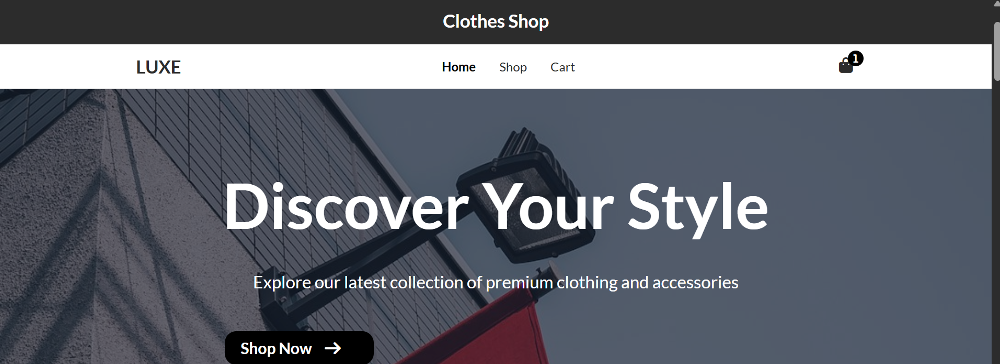
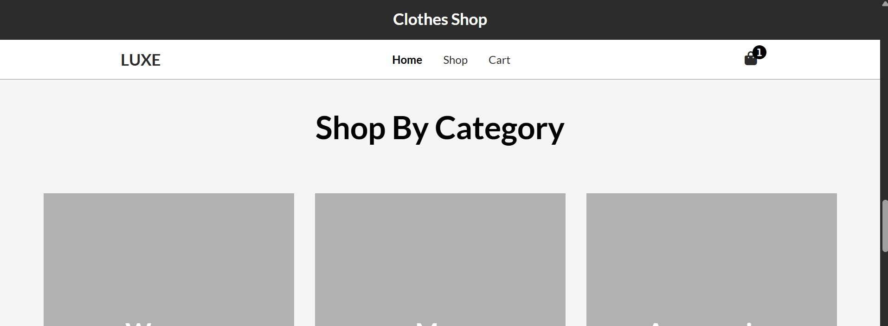
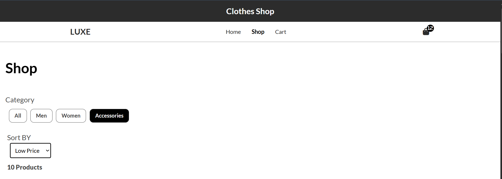
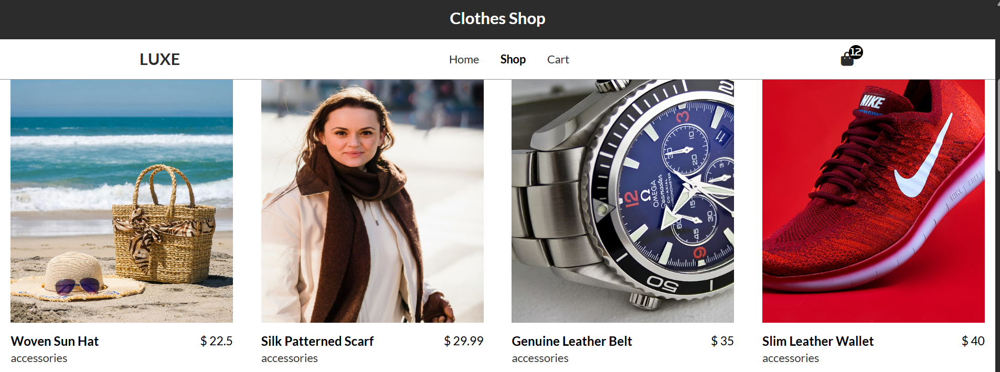
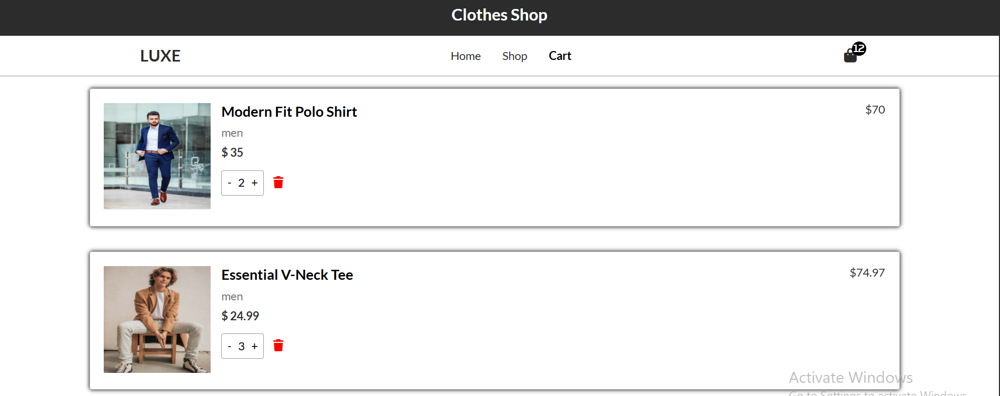
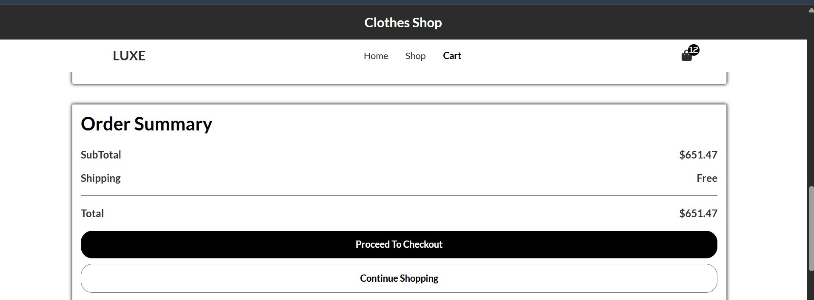

<div align="center">

# 🛍️ Shop Store

### Modern E-Commerce Website built with **HTML, CSS & Vanilla JavaScript**

<p>
  <a href="https://shop-store-x-git-main-anasskafafy5-sources-projects.vercel.app/" target="_blank">
    
  </a>
</p>

<p>
  
  
  
  
</p>

### 🚀 My first complete E-Commerce project built entirely with Vanilla JavaScript

*"Building this project helped me establish a solid foundation in front-end development before moving to React and Next.js."*

</div>

---

# 📖 About The Project

**Shop Store** is my first complete E-Commerce project, built from scratch using **HTML**, **CSS**, and **Vanilla JavaScript**.

The goal of this project was to understand how real e-commerce websites work without relying on frameworks or external libraries.

Everything—from rendering products and handling user interactions to managing the shopping cart—was implemented using pure JavaScript.

One of the biggest challenges was creating and organizing the product data manually. Although it required a lot of time and effort, it significantly improved my understanding of JavaScript objects, arrays, application structure, and dynamic rendering.

This project represents an important milestone in my learning journey and gave me the confidence to build larger applications with modern technologies.

---

# 🌐 Live Demo

👉 **Visit the Website**

https://shop-store-x-git-main-anasskafafy5-sources-projects.vercel.app/

---

# 📸 Project Preview

<div align="center">

### 🏠 Home Page



---

### 🛍️ Shop Page



---

### 📦 Product Details



---

### 🛒 Shopping Cart



---

### 📱 Responsive Design



---

### ✨ More Screens



</div>

---

# ✨ Features

- 🛍️ Modern E-Commerce Interface
- 🏠 Home Page
- 🛒 Shop Page
- 📦 Product Details Page
- 🛍️ Shopping Cart
- 📱 Fully Responsive Design
- ⚡ Fast Performance
- 🔍 Dynamic Product Rendering
- ➕ Add Products to Cart
- ➖ Remove Products from Cart
- 💾 Local Storage Support
- 🎨 Clean UI Design

---

# 🛠️ Built With

- HTML5
- CSS3
- Vanilla JavaScript (ES6)

No frameworks.
No libraries.
Just pure JavaScript.

---

# 📂 Project Structure

```text
Shop-Store/
│
├── assets/
│   ├── img1.png
│   ├── img2.png
│   ├── img3.png
│   ├── img4.png
│   ├── img5.png
│   └── img6.png
│
├── js/
│   └── main.js
│
├── pages/
│   ├── home.html
│   ├── shop.html
│   ├── productPage.html
│   └── cart.html
│
├── styles/
│   └── style.css
│
├── index.html
└── README.md
```

---

# 🎯 What I Learned

Building this project helped me improve my understanding of:

- JavaScript Fundamentals
- DOM Manipulation
- Event Handling
- Arrays & Objects
- Dynamic Rendering
- Local Storage
- Responsive Design
- Code Organization
- Multi-page Website Structure

---

# 💡 Challenges

One of the most time-consuming parts of this project was preparing and organizing the product data manually.

Instead of using an external API, I created and structured the data myself, which helped me understand how data flows inside an application and how dynamic interfaces are built using JavaScript.

---

# 🚀 Future Improvements

Some features I'd like to add in a future version include:

- ❤️ Wishlist
- 🔍 Product Search
- 🎯 Product Filtering
- 📑 Product Categories
- ⭐ Product Reviews
- 👤 User Authentication
- 💳 Checkout Process
- 🗄️ Backend Integration

---

# 🌱 What's Next?

This project laid the foundation for my front-end journey.

My next goal is to build a much more advanced E-Commerce application using **Next.js**, server-side rendering, authentication, databases, and modern best practices.

---

# 👨‍💻 Author

**Anass Kafafy**

Front-End Developer

---

<div align="center">

### ⭐ If you enjoyed this project, consider giving it a Star!

**Thank you for visiting my repository ❤️**

</div>
